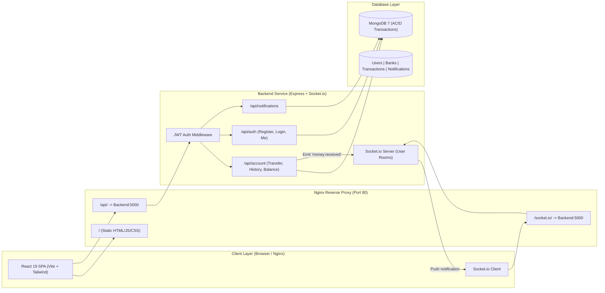

# 💳 Paytm Clone — Full-Stack Real-Time Payments Platform

A modern, high-performance, full-stack digital wallet and peer-to-peer payment application inspired by Paytm. Built with **React 19**, **Node.js/Express**, **MongoDB**, **Socket.io**, and **Docker**, this platform delivers instant money transfers with ACID transaction safety, live push notifications, transaction ledgers, and printable receipts.

---

## 📸 Screenshots & Visual Walkthrough

### 1. Dashboard & User Search
Real-time balance display, dynamic user search with debounced filtering, quick action buttons, and latest transaction history.


---

### 2. Send Money Modal
Clean and focused transfer workflow with recipient details and input validation.


---

### 3. Transfer Success Confirmation
Instant feedback card displaying transaction reference IDs, transfer amount, and quick navigation links.


---

### 4. Real-Time Push Notifications & Live Balance Sync
Live Socket.io toast notifications for incoming money with an interactive *"View Dashboard"* action and automatic unread counter badge.


---

### 5. Transaction History Ledger
Filterable by Debit / Credit / All with pagination controls, status indicators, and automatic 30-second polling.


---

### 6. Interactive & Printable Payment Receipt
Detailed popup modal showing exact timestamps, sender/recipient metadata, reference IDs with one-click copy, and printer-friendly layout.


---

## 🚀 Key Features

- 💸 **Instant Peer-to-Peer Transfers**: Transfer funds seamlessly between users with atomic balance deduction and addition.
- 🛡️ **ACID Transaction Safety**: Uses MongoDB Multi-Document Transactions (`session.withTransaction`) to guarantee data integrity and automatic rollback on failure (with graceful standalone fallback).
- ⚡ **Real-Time WebSockets (Socket.io)**: Authenticated WebSocket rooms deliver instant push notifications and auto-refresh balances the moment money is received.
- 🔔 **Notification Center**: Notification bell dropdown with unread badge counter, relative timestamps (*"2m ago"*), one-click mark as read, and *"Mark all as read"*.
- 📜 **Full Transaction History**: Paginated ledger with filtering (Debit / Credit / All) and real-time live event synchronization.
- 🧾 **Audit-Ready Payment Receipts**: Modal receipts complete with exact ISO timestamps, counterpart user details, unique reference IDs, and print capability.
- 🔒 **Secure Authentication**: Stateless JWT auth with `bcryptjs` password hashing, protected Express middleware, and Axios interceptor redirects on expiration.
- 🧪 **Comprehensive Automated Testing**: 100% passing test suite using Jest, Supertest, and in-memory MongoDB (`@shelf/jest-mongodb`).
- 🐳 **Production-Grade Dockerization**: Multi-stage Dockerfiles for backend and frontend (Nginx with SPA fallback and WebSocket proxying) orchestrated via Docker Compose.

---

## 🛠️ Technology Stack

| Layer | Technology | Purpose |
| :--- | :--- | :--- |
| **Frontend UI** | React 19, Vite | Modern component-based SPA architecture and fast HMR bundling |
| **Styling** | Tailwind CSS v4 | Responsive, clean, and modern styling tokens |
| **Real-Time Client** | Socket.io-client | Live WebSocket connection authenticated via JWT |
| **Toast Engine** | Sonner | Rich, interactive toast alerts with direct action callbacks |
| **HTTP Client** | Axios | REST client configured with global auth interceptors |
| **Backend Server** | Node.js, Express | Scalable REST API with modular route architecture |
| **Real-Time Server** | Socket.io | Server-side WebSocket rooms keyed by MongoDB user IDs |
| **Database** | MongoDB 7, Mongoose | Schema validation, compound indexing, and ACID transactions |
| **Validation** | Zod | Strict schema validation for registration, login, and transfers |
| **Authentication** | JSON Web Tokens (JWT), Bcrypt.js | Stateless bearer tokens and secure salt-hashed passwords |
| **Testing** | Jest, Supertest, MongoMemoryServer | End-to-end endpoint testing in an isolated in-memory DB |
| **Code Quality** | ESLint | Strict JavaScript code quality and standards enforcement |
| **Reverse Proxy** | Nginx (Alpine) | Production SPA static serving, Gzip compression, and API proxying |
| **Containers** | Docker, Docker Compose | Multi-stage production container builds and local development overrides |

---

## 🏗️ System Architecture



---

## 💻 Getting Started (How to Run Locally)

### Prerequisites

Ensure you have the following installed on your machine:
- **Node.js** (v20.x or higher)
- **npm** (v10.x or higher)
- **MongoDB** (v6.x / v7.x running locally on port `27017`) *OR* **Docker Desktop**

---

### Option 1: Quick Run with Docker Compose (Recommended)

Run the complete multi-container stack (Frontend, Backend, and MongoDB) with a single command:

1. **Clone the repository**:
   ```bash
   git clone https://github.com/Shivam000189/Ptm-trans.git
   cd ptm
   ```

2. **Create environment file**:
   ```bash
   cp .env.example .env
   ```

3. **Start all services**:
   ```bash
   docker compose up --build
   ```

4. **Access the application**:
   - **Frontend App**: Open [http://localhost](http://localhost)
   - **Backend API**: Open [http://localhost:5000/api](http://localhost:5000/api)
   - **MongoDB**: Available at `localhost:27017`

---

### Option 2: Run with Docker Compose (Development Mode + Hot Reloading)

To run with source code mounted as volumes and `nodemon` / `vite` active for live development:

```bash
docker compose -f docker-compose.yml -f docker-compose.dev.yml up --build
```
- **Frontend**: [http://localhost:5173](http://localhost:5173)
- **Backend**: [http://localhost:5000](http://localhost:5000)

---

### Option 3: Run Manually on Host Machine (Without Docker)

#### 1. Start MongoDB
Ensure MongoDB is running locally:
```bash
mongod
```

#### 2. Start Backend Service
```bash
cd backend
npm install
npm run dev
```
The backend server will start on `http://localhost:5000`.

#### 3. Start Frontend Service
Open a new terminal:
```bash
cd paytm
npm install
npm run dev
```
The frontend Vite server will start on `http://localhost:5173`.

---

## 🧪 Running Automated Tests & Code Quality

### Run Jest Test Suite (with In-Memory MongoDB & Coverage)
```bash
cd backend
npm test
```

### Run Tests in Watch Mode
```bash
cd backend
npm run test:watch
```

### Run ESLint Linter
```bash
cd backend
npm run lint
```

### Validate Frontend Production Build
```bash
cd paytm
npm run build
```

---

## 📡 API Reference Overview

### 🔐 Authentication (`/api/auth`)
| Method | Endpoint | Description | Auth Required |
| :--- | :--- | :--- | :--- |
| `POST` | `/api/auth/register` | Register new user & creates initial bank balance | No |
| `POST` | `/api/auth/login` | Authenticate user & return JWT token | No |
| `GET` | `/api/auth/me` | Get profile of logged-in user | Yes |
| `GET` | `/api/auth/user/bulk` | Search users by name/email with `?filter=` | Yes |

### 💰 Account & Transfers (`/api/account`)
| Method | Endpoint | Description | Auth Required |
| :--- | :--- | :--- | :--- |
| `GET` | `/api/account/balance` | Fetch current account balance | Yes |
| `POST` | `/api/account/transfer` | Execute atomic money transfer to recipient | Yes |
| `GET` | `/api/account/history` | Paginated transaction history (`?page=&limit=&type=`) | Yes |

### 🔔 Notifications (`/api/notifications`)
| Method | Endpoint | Description | Auth Required |
| :--- | :--- | :--- | :--- |
| `GET` | `/api/notifications` | Get paginated notification list (`?limit=5`) | Yes |
| `GET` | `/api/notifications/unread-count` | Get total count of unread notifications | Yes |
| `PUT` | `/api/notifications/:id/read` | Mark a single notification as read | Yes |
| `PUT` | `/api/notifications/read-all` | Mark all unread notifications as read | Yes |

---

## 📁 Repository Structure

```plaintext
ptm/
├── .env.example                 # Root environment variable template
├── docker-compose.yml           # Production Docker Compose orchestration
├── docker-compose.dev.yml       # Development Docker Compose override (hot-reloading)
├── README.md                    # Project documentation
├── data/                        # UI screenshots and visual assets
│   ├── Screenshot 2026-08-31 102046.png   # Dashboard UI
│   ├── Screenshot 2026-08-31 102057.png   # Send Money Modal
│   ├── Screenshot 2026-08-31 102107.png   # Transfer Success Confirmation
│   ├── Screenshot 2026-08-31 102118.png   # Real-time Push Notification
│   ├── Screenshot 2026-08-31 102130.png   # Transaction History Ledger
│   └── Screenshot 2026-08-31 102142.png   # Printable Payment Receipt
├── backend/                     # Express.js REST API & Socket.io Server
│   ├── Dockerfile               # Multi-stage production build (Node 20 Alpine)
│   ├── jest.config.js           # Jest in-memory MongoDB configuration
│   ├── eslint.config.js         # ESLint flat config
│   ├── index.js                 # Server entrypoint with HTTP & WebSocket setup
│   ├── src/
│   │   ├── config/              # MongoDB database connection
│   │   ├── middleware/          # JWT auth middleware
│   │   ├── models/              # User, Bank, Transaction, Notification schemas
│   │   └── routes/              # Auth, Account, and Notification routers
│   └── tests/                   # Jest + Supertest suites (auth & transfer)
└── paytm/                       # React 19 Frontend Application (Vite + Tailwind)
    ├── Dockerfile               # Multi-stage build with Nginx Alpine
    ├── nginx.conf               # Custom Nginx config with SPA & WebSocket proxy
    └── src/
        ├── api/                 # Axios instance with auth interceptor
        ├── components/          # Reusable components (ReceiptModal, etc.)
        ├── pages/               # Dashboard, Transactions, SendMoney, SignIn, SignUp
        ├── socket.js            # Socket.io client setup with JWT auth
        └── App.jsx              # Routing, Toaster, and Socket lifecycle manager
```

---

## 📄 License

This project is licensed under the [ISC License](LICENSE).
